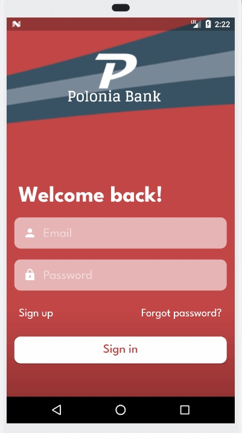
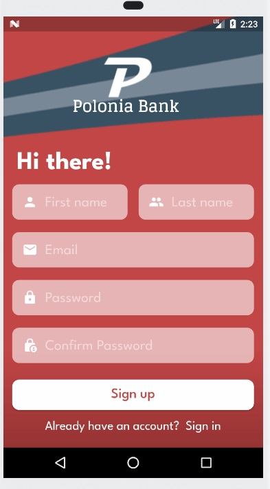
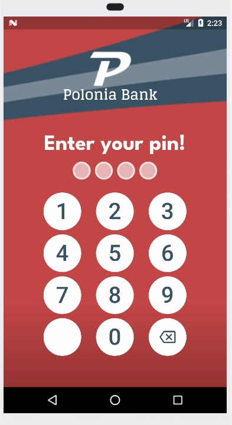
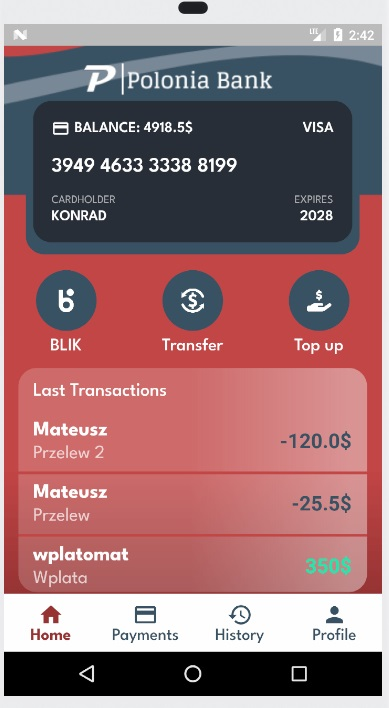
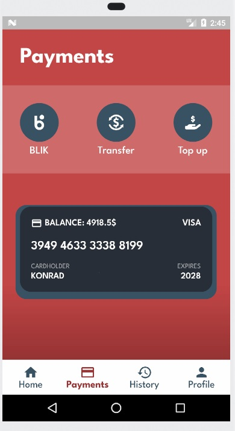
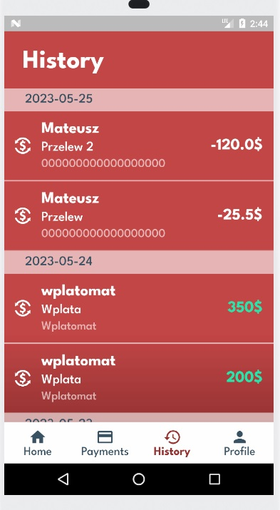
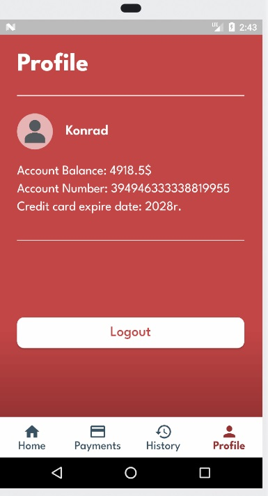
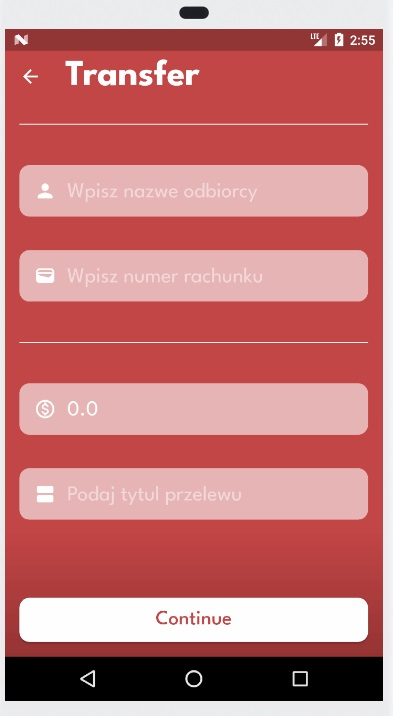
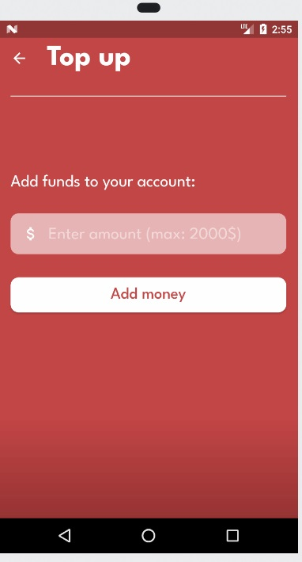
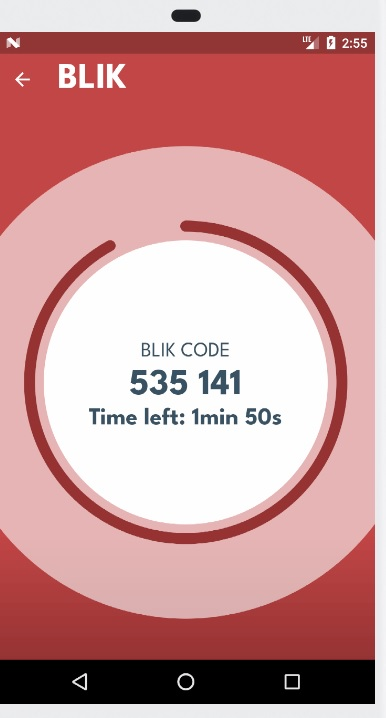

<h1>Aplikacja Bankowa</h1>

<h2>Description</h2>
The Bank App is a mobile application that allows users to perform various banking operations on their accounts. The app is implemented using the Flutter framework, enabling it to run on both iOS and Android platforms.

<h2>Features</h2>
<h3>Login and registration</h3>
The app allows users to register a new account or login to an existing account. After registration, user create uniqe 4 digit pin that is always required to sign in.  
<table>
        <tr>
            <td>
                
            </td>
           <td>
                
            </td>
            <td>
                
            </td>
        </tr>
</table>

<h3>Home screen and navigation</h3>
Home page contain all nedded informations (e.g., current balance, account number, payment methods, last transactions, navigation panel). Also there are pages for transfers, transactions history and profile. 
<table>
        <tr>
            <td>
                
            </td>
           <td>
                
            </td>
            <td>
                
            </td>
          <td>
                
            </td>
        </tr>
</table>

<h3>Managing account balance</h3>
<table>
  <th>
    <h4>Transfers</h4>
  </th>
  <th>
    <h4>Account Top-up</h4>
  </th>
    <th>
    <h4>BLIK Code</h4>
  </th>
  <tr>
    <td>
      Users can make transfers between other bank accounts. They can enter recipient details and the amount they want to transfer. 
    </td>
    <td>
    Users also have the option to top up their account using the app. They can enter the desired top-up amount.
    </td>
    <td>
     App shows BLIK codes (only visual implementation). Users can generate a BLIK code, which is a one-time payment code. 
    </td>
  </tr>
        <tr>
            <td>
                
            </td>
           <td>
                
            </td>
           <td>
                
            </td>
        </tr>
</table>

<h2>Authors</h2>
- https://github.com/xMatty522 
- https://github.com/Squashim
